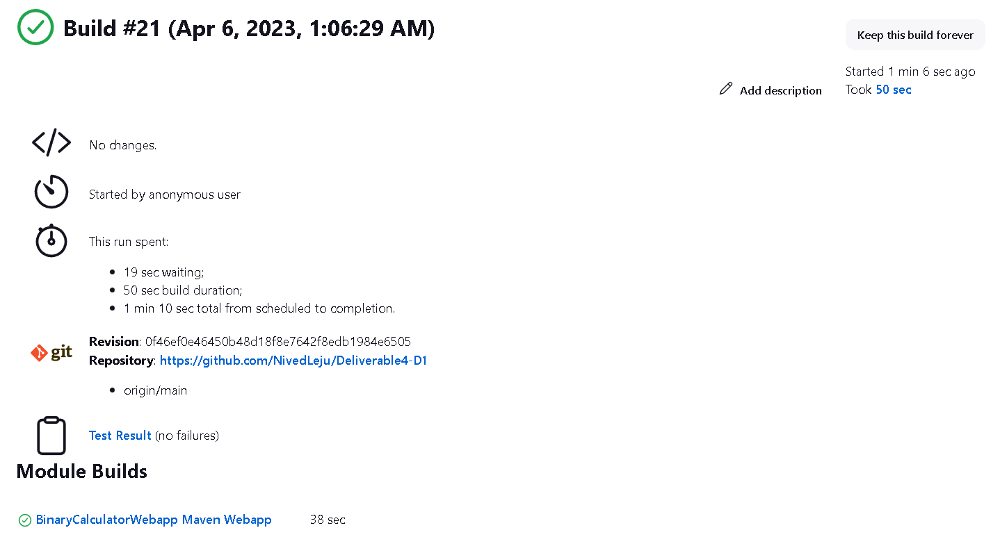
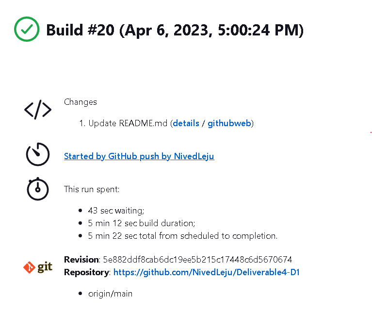
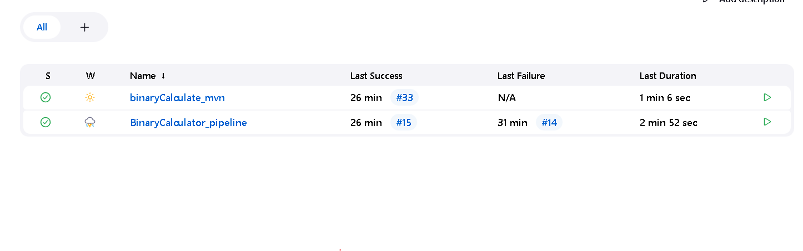
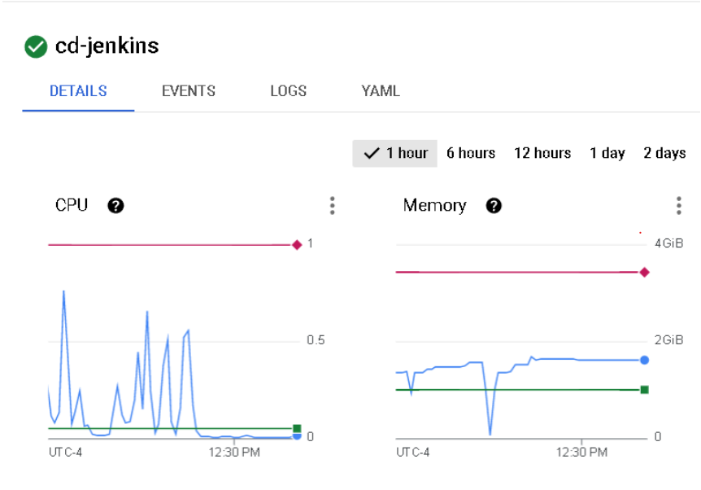

# Milestone 4: Continuous Integration and Continuous Delivery (Jenkins) 
## Objective   
1. Git Familiar with Jenkins.
2. Understand the pipeline syntax used by Jenkins.
3. Configure a continuous integration pipeline for a Jenkins job.
4. Configure a continuous deployment pipeline for a Jenkins job.

## Images showing the steps used to setup the project

Created Kubernetes cluster in the GCP Kubernetes Engine API

Obtaining cluster information to make sure the cluster is connected using the google cloud sdk

Using Helm CLI to deploy chart cd=jenkins from given repository

Cloning given repository for use within the project

Getting information about Kubernetes cluster services running for the project

The Jenkins Dashboard

Creating github server within Jenkins and verifying connectivity (bottom left of image)

Creating and connecting webhook from Jenkins to Github repository

The main project built in Jenkins

## Design Part

### Part 1
Image below shows build success after uploading latest Binary Calculator Project to repository and the build number shows the continous deployment for the BinaryCalculate_mvn

### Part 2
Image below shows the successful implementation of the BinaryCalculator_pipeline to continously deploy to GKE

This image shows that the both jobs executed together, and shows build success

This image shows that the kubernetes engine is processing the information sent to the cluster from the jenkins builds

