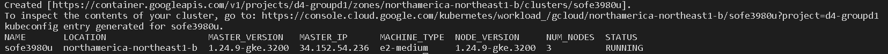
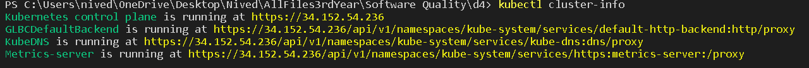
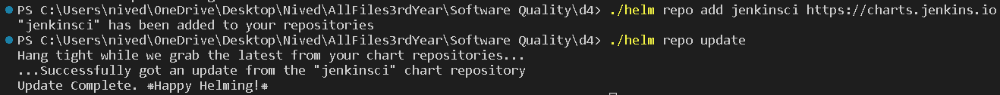
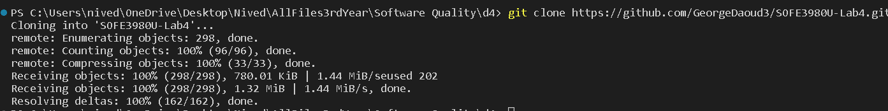
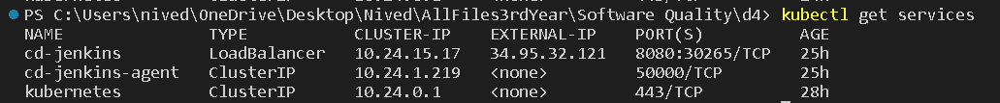
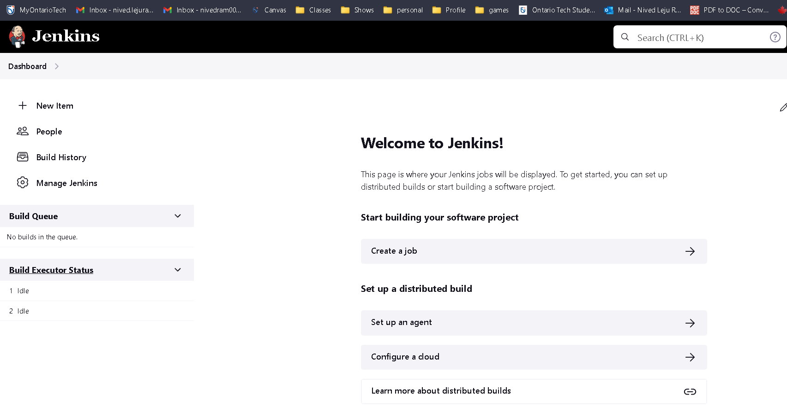
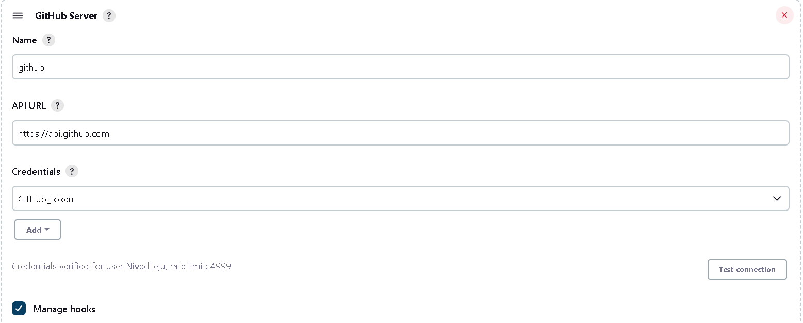
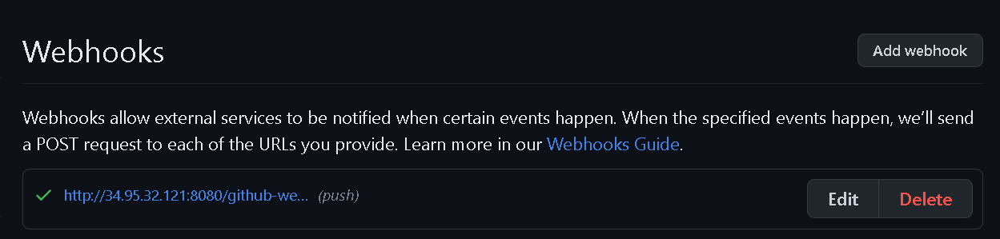

# Milestone 4: Continuous Integration and Continuous Delivery (Jenkins) 
## Objective   
1. Git Familiar with Jenkins.
2. Understand the pipeline syntax used by Jenkins.
3. Configure a continuous integration pipeline for a Jenkins job.
4. Configure a continuous deployment pipeline for a Jenkins job.

## Images showing the steps used to setup the project

created Kubernetes cluster in the GCP Kubernetes Engine API

